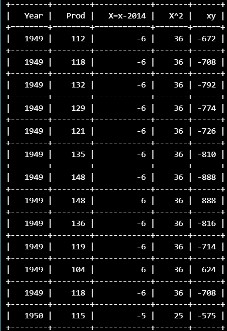
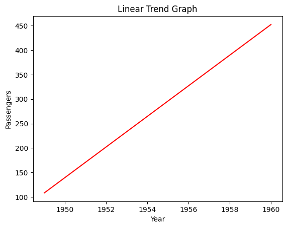
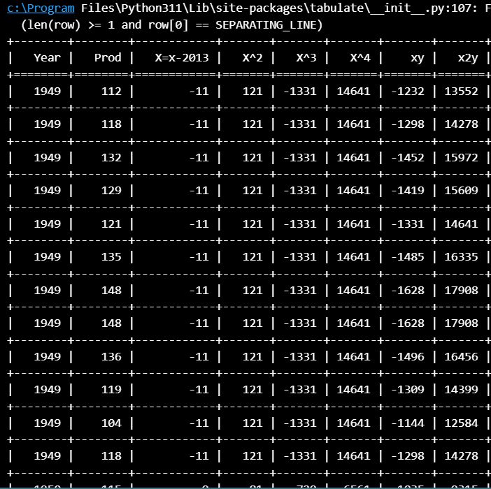
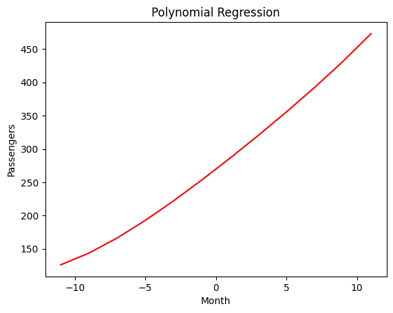

### Name : Kavinraja D
### Register number: 212222240047
# Ex.No: 02 LINEAR AND POLYNOMIAL TREND ESTIMATION
Date:
### AIM:
To Implement Linear and Polynomial Trend Estiamtion Using Python.

### ALGORITHM:
Import necessary libraries (NumPy, Matplotlib)

Load the dataset

Calculate the linear trend values using least square method

Calculate the polynomial trend values using least square method

PLot the graph.
### PROGRAM:
## A - LINEAR TREND ESTIMATION
```py
## LINEAR TREND ESTIMATION
import pandas as pd
import numpy as np
import matplotlib.pyplot as plt
from tabulate import tabulate
%matplotlib inline
train = pd.read_csv('AirPassengers.csv')

train['Month'] = pd.to_datetime(train['Month'], format='%Y-%m')
train['Year'] = train['Month'].dt.year
train.head()

year = train['Year'].values.reshape(-1, 1)
values = train['#Passengers'].values

x=year
y=values
```
```py

X = [i - x[len(x)//2] for i in x]
x2 = [i ** 2 for i in X]
xy = [i * j for i, j in zip(X, y)]
table = [[i, j, k, l, m] for i, j, k, l, m in zip(x, y, X, x2, xy)]
print(tabulate(table, headers=["Year", "Prod", "X=x-2014", "X^2", "xy"], tablefmt="grid"))
```
```py
from sklearn.linear_model import LinearRegression
lin = LinearRegression()
lin.fit(X, y)
n=len(x)
b=(n*sum(xy)-sum(y)sum(X))/(n*sum(x2)-(sum(X)*2))
a=(sum(y)-b*sum(X))/n
print("a=%.1f,b=%.1f"%(a,b))
```
```py
l=[]
for i in range(n):
  l.append(a+b*X[i]);
print("Trend Equation : y=%d+%.2fx"%(a,b))
import matplotlib.pyplot as plt
plt.title("Linear Trend Graph")
plt.xlabel("Year")
plt.ylabel("Passengers")
plt.plot(x,l,color='red')
plt.show()
```
```py

pred = 110.0
predarray = np.array([[pred]])
lin.predict(predarray)

```

## B- POLYNOMIAL TREND ESTIMATION
```py
## POLYNOMIAL TREND ESTIMATION

import numpy as np
import matplotlib.pyplot as plt
from sklearn.linear_model import LinearRegression
from sklearn.preprocessing import PolynomialFeatures
import pandas as pd
from tabulate import tabulate
```
```py

train = pd.read_csv('AirPassengers.csv')
train['Month'] = pd.to_datetime(train['Month'], format='%Y-%m')
train['Year'] = train['Month'].dt.year
train.head()
```
```py

year = train['Year'].values.reshape(-1, 1)
values = train['#Passengers'].values
x=year
y=values
X = [2*(i-(sum(x)/len(x))) for i in x]
x2 = [i ** 2 for i in X]
xy = [i * j for i, j in zip(X, y)]
x3 = [i ** 3 for i in X]
x4 = [i ** 4 for i in X]
x2y = [i * j for i, j in zip(x2, y)]
table = [[i, j, k, l, m,n,o,p] for i, j, k, l, m,n,o,p in zip(x, y, X, x2, x3,x4,xy,x2y)]
print(tabulate(table, headers=["Year", "Prod", "X=x-2013", "X^2", "X^3", "X^4", "xy", "x2y"], tablefmt="grid"))
```
```py

from sklearn.linear_model import LinearRegression
lin = LinearRegression()
lin.fit(X, y)
from sklearn.preprocessing import PolynomialFeatures
poly = PolynomialFeatures(degree=4)
X_poly = poly.fit_transform(X)
poly.fit(X_poly, y)
```
```py
lin2 = LinearRegression()
lin2.fit(X_poly, y)
plt.plot(X, lin2.predict(poly.fit_transform(X)),
color='red')
plt.title('Polynomial Regression')
plt.xlabel('Month')
plt.ylabel('Passengers')
plt.show()

pred2 = 110.0
pred2array = np.array([[pred2]])
lin2.predict(poly.fit_transform(pred2array))
```

### OUTPUT
#### A- LINEAR TREND ESTIMATION



#### B- POLYNOMIAL TREND ESTIMATION


### RESULT:
Thus the python program for linear and Polynomial Trend Estiamtion has been executed successfully.
